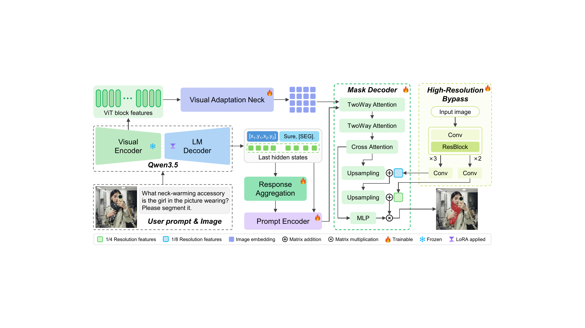
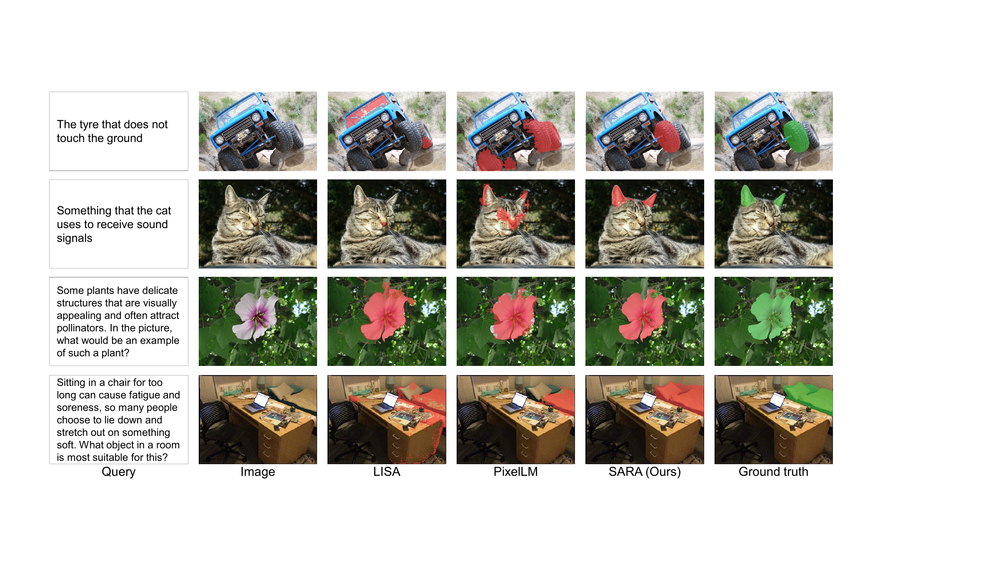

# SARA: Unified Referring and Reasoning Segmentation with Semantic-Detail Visual Adaptation

SARA is a unified model for referring and reasoning segmentation. It uses Qwen3.5 as the vision-language backbone and reuses intermediate visual features for mask prediction without an additional heavyweight segmentation image encoder. The code supports SARA-2B, SARA-4B, and SARA-9B.

<p align="center">
  
</p>

## Results

**Results on the RefCOCO benchmark family.** All values are cIoU. The best and second-best results are shown in bold and underlined text.

| Method | Publication | Backbone | Extra encoder | RefCOCO Val | TestA | TestB | RefCOCO+ Val | TestA | TestB | RefCOCOg Val | Test |
|:--|:--|:--|:--:|--:|--:|--:|--:|--:|--:|--:|--:|
| LISA | CVPR 2024 | LLaVA-7B | Yes | 74.9 | 79.1 | 72.3 | 65.1 | 70.8 | 58.1 | 67.9 | 70.6 |
| GSVA | CVPR 2024 | Vicuna-7B | Yes | 77.2 | 78.9 | 73.5 | 65.9 | 69.6 | 59.8 | 72.7 | 73.3 |
| AnyRef | CVPR 2024 | LLaVA-7B | Yes | 76.9 | 79.9 | 74.2 | 70.3 | 73.5 | 61.8 | 70.0 | 70.7 |
| PixelLM | CVPR 2024 | LLaVA-7B | No | 73.0 | 76.5 | 68.2 | 66.3 | 71.7 | 58.3 | 69.3 | 70.5 |
| VisionLLM v2 | NeurIPS 2024 | Vicuna-7B | Yes | 76.6 | 79.3 | 74.3 | 64.5 | 69.8 | 61.5 | 70.7 | 71.2 |
| Text4Seg | ICLR 2025 | InternVL2-8B | No | 79.2 | 81.7 | 75.6 | 72.8 | 77.9 | 66.5 | 74.0 | 75.3 |
| Text4Seg | ICLR 2025 | LLaVA-1.5-13B | No | 80.2 | 82.7 | 77.3 | 73.7 | 78.6 | 67.6 | 74.0 | 75.1 |
| SegAgent | CVPR 2025 | LLaVA-7B | Yes | 79.2 | 81.4 | 75.7 | 71.5 | 76.7 | 65.4 | 74.8 | 74.9 |
| M<sup>2</sup>SA | ICLR 2025 | Llama2-13B | Yes | 74.6 | 77.6 | 71.0 | 64.0 | 68.1 | 57.6 | 69.0 | 69.3 |
| UFO | NeurIPS 2025 | InternVL2-8B | No | 78.0 | 79.7 | 75.6 | 72.3 | 76.8 | 66.6 | 73.7 | 74.3 |
| RSAT | KBS 2026 | LLaVA-7B | Yes | 77.7 | 79.1 | 73.9 | 66.7 | 71.3 | 60.7 | 72.1 | 73.6 |
| SAM3 | ICLR 2026 | N/A | N/A | 75.5 | 77.6 | 71.0 | 67.3 | 71.1 | 63.4 | 73.4 | 74.0 |
| PixelThink | ICML 2026 | Qwen2.5-VL-7B | Yes | N/A | 79.3 | N/A | N/A | 74.8 | N/A | 73.9 | N/A |
| VisionReasoner | ICLR 2026 | Qwen2.5-VL-7B | Yes | N/A | 78.9 | N/A | N/A | 74.9 | N/A | N/A | 71.3 |
| TALENT | CVPR 2026 | CLIP | Yes | 75.9 | 78.3 | 72.8 | 66.9 | 72.3 | 58.8 | N/A | N/A |
| DPAD | CVPR 2026 | Qwen2.5-VL-7B | Yes | N/A | 79.3 | N/A | N/A | 74.7 | N/A | N/A | 72.6 |
| SARA-2B | Ours | Qwen3.5-2B | No | 78.6 | 81.4 | 75.0 | 73.9 | 78.4 | 69.3 | 76.6 | 77.5 |
| SARA-4B | Ours | Qwen3.5-4B | No | <u>82.3</u> | <u>83.6</u> | <u>79.4</u> | <u>77.8</u> | <u>81.9</u> | <u>72.9</u> | <u>80.1</u> | <u>80.5</u> |
| **SARA-9B** | **Ours** | **Qwen3.5-9B** | **No** | **82.7** | **84.6** | **80.2** | **79.0** | **82.8** | **74.2** | **80.5** | **81.4** |

**Results on the ReasoningSeg benchmark.** The best results are shown in bold.

| Method | Size | Val gIoU | Val cIoU | Test gIoU | Test cIoU |
|:--|--:|--:|--:|--:|--:|
| LISA | 7B | 53.6 | 52.3 | 48.7 | 48.8 |
| LISA | 13B | 57.7 | 60.3 | 53.8 | 50.8 |
| SAM4MLLM | 8B | 46.7 | 48.1 | N/A | N/A |
| Seg-Zero | 7B | 62.6 | 62.0 | 57.5 | 52.0 |
| SegLLM | 7B | 57.2 | 54.3 | 52.4 | 48.4 |
| RSAT | 7B | 55.4 | 58.7 | 48.4 | 51.9 |
| SARA-2B | 2B | 60.2 | 55.9 | 49.5 | 49.7 |
| SARA-4B | 4B | 62.2 | 60.1 | 55.6 | 55.4 |
| **SARA-9B** | **9B** | **64.8** | **68.4** | **59.8** | **61.7** |

## Qualitative Results

<p align="center">
  
</p>

## Installation

```bash
git clone https://github.com/limiaowu/SARA.git
cd SARA
conda create -n sara python=3.12 -y
conda activate sara
pip install -r requirements.txt
```

The released code is tested with PyTorch 2.6.0. FlashAttention 2 is used by default. When FlashAttention is unavailable, pass `--attn_implementation sdpa` to the training, evaluation, or inference command.

Download a Qwen3.5 checkpoint and the SAM 2.1 Hiera Large checkpoint before running SARA. Model weights and datasets are not stored in this repository.

## Data Preparation

The RefCOCO family follows the standard REFER layout:

```text
refcoco_root/
├── refcoco/
├── refcoco+/
└── refcocog/
    ├── instances.json
    └── refs(...).p

coco_image_root/
└── COCO_train2014_*.jpg
```

ReasoningSeg is expected to contain paired image and JSON annotation files:

```text
reasoning_seg_root/
├── train/
├── val/
└── test/
```

## Training

Dataset specifications use `name:split[:repeat]`. The optional repeat value controls oversampling when datasets are mixed.

```bash
torchrun --nproc_per_node=4 train.py \
  --qwen_model_path /path/to/Qwen3.5-9B \
  --sam2_ckpt_path /path/to/sam2.1_hiera_large.pt \
  --refcoco_root /path/to/refcoco_root \
  --coco_image_root /path/to/coco/train2014 \
  --reasoning_seg_root /path/to/ReasoningSeg \
  --train_specs refcoco:train refcoco+:train refcocog:train reasoning_seg:train:100 \
  --val_specs refcoco:val \
  --hook_layers 3 6 13 20 26 \
  --num_queries 32 \
  --image_size 1024 \
  --mask_size 1024 \
  --lora_r 64 \
  --lora_alpha 128 \
  --batch_size 4 \
  --grad_accum 1 \
  --deepspeed ds_config.json \
  --run_name sara-9b
```

`batch_size` is the per-device batch size. Adjust it together with `grad_accum` and the number of processes to obtain the desired effective batch size.

## Evaluation

```bash
torchrun --nproc_per_node=4 evaluate.py \
  --ckpt /path/to/sara_weights.pt \
  --qwen_model_path /path/to/Qwen3.5-9B \
  --sam2_ckpt /path/to/sam2.1_hiera_large.pt \
  --refcoco_root /path/to/refcoco_root \
  --coco_image_root /path/to/coco/train2014 \
  --reasoning_seg_root /path/to/ReasoningSeg \
  --datasets refcoco refcoco+ refcocog reasoning_seg
```

## Inference

```bash
python infer.py \
  --ckpt /path/to/sara_weights.pt \
  --qwen_model_path /path/to/Qwen3.5-9B \
  --sam2_ckpt /path/to/sam2.1_hiera_large.pt \
  --image /path/to/image.jpg \
  --query "What object is used for sitting?"
```

Omit `--image` and `--query` to start an interactive session. The predicted mask, overlay, and generated response are written to `outputs/inference` by default.

## Acknowledgements

This project builds on Qwen3.5 and SAM 2. We also thank the authors of LISA and PixelLM for advancing multimodal segmentation research.

## License

This repository is released under the Apache License 2.0. Third-party models, checkpoints, and datasets remain subject to their respective licenses.
