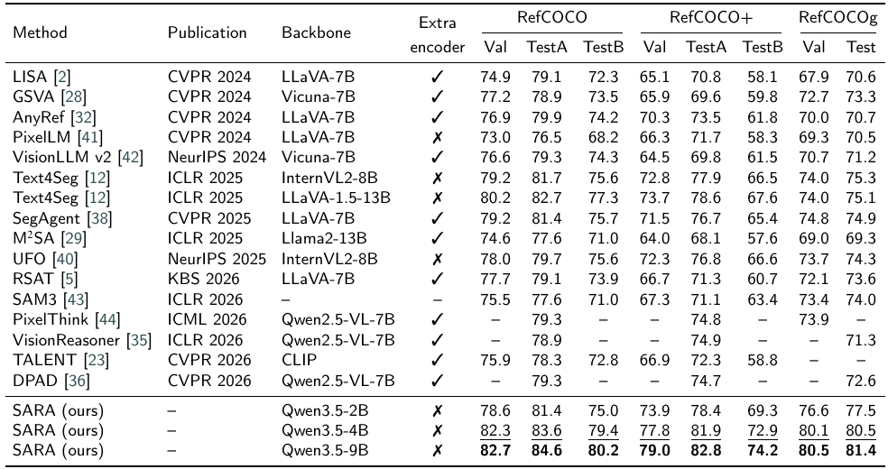
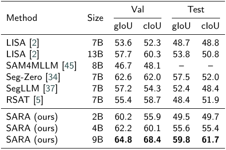

# Reusing Internal Vision-Language Representations for Native Referring and Reasoning Segmentation

SARA is a unified model for referring and reasoning segmentation. It uses Qwen3.5 as the vision-language backbone and reuses intermediate visual features for mask prediction without an additional heavyweight segmentation image encoder. The code supports SARA-2B, SARA-4B, and SARA-9B.

<p align="center">
  
</p>

## Results

**Results on the RefCOCO benchmark family.** All values are cIoU. The best and second-best results are shown in bold and underlined text.

<p align="center">
  
</p>

**Results on the ReasoningSeg benchmark.** The best results are shown in bold.

<p align="center">
  
</p>

## Qualitative Results

<p align="center">
  
</p>

## Installation

```bash
git clone https://github.com/limiaowu/SARA.git
cd SARA
conda create -n sara python=3.12 -y
conda activate sara
pip install -r requirements.txt
```

The released code is tested with PyTorch 2.6.0. FlashAttention 2 is used by default. When FlashAttention is unavailable, pass `--attn_implementation sdpa` to the training, evaluation, or inference command.

Download a Qwen3.5 checkpoint and the SAM 2.1 Hiera Large checkpoint before running SARA. Model weights and datasets are not stored in this repository.

## Data Preparation

The RefCOCO family follows the standard REFER layout:

```text
refcoco_root/
├── refcoco/
├── refcoco+/
└── refcocog/
    ├── instances.json
    └── refs(...).p

coco_image_root/
└── COCO_train2014_*.jpg
```

ReasoningSeg is expected to contain paired image and JSON annotation files:

```text
reasoning_seg_root/
├── train/
├── val/
└── test/
```

## Training

Dataset specifications use `name:split[:repeat]`. The optional repeat value controls oversampling when datasets are mixed.

```bash
torchrun --nproc_per_node=4 train.py \
  --qwen_model_path /path/to/Qwen3.5-9B \
  --sam2_ckpt_path /path/to/sam2.1_hiera_large.pt \
  --refcoco_root /path/to/refcoco_root \
  --coco_image_root /path/to/coco/train2014 \
  --reasoning_seg_root /path/to/ReasoningSeg \
  --train_specs refcoco:train refcoco+:train refcocog:train reasoning_seg:train:100 \
  --val_specs refcoco:val \
  --hook_layers 3 6 13 20 26 \
  --num_queries 32 \
  --image_size 1024 \
  --mask_size 1024 \
  --lora_r 64 \
  --lora_alpha 128 \
  --batch_size 4 \
  --grad_accum 1 \
  --deepspeed ds_config.json \
  --run_name sara-9b
```

`batch_size` is the per-device batch size. Adjust it together with `grad_accum` and the number of processes to obtain the desired effective batch size.

## Evaluation

```bash
torchrun --nproc_per_node=4 evaluate.py \
  --ckpt /path/to/sara_weights.pt \
  --qwen_model_path /path/to/Qwen3.5-9B \
  --sam2_ckpt /path/to/sam2.1_hiera_large.pt \
  --refcoco_root /path/to/refcoco_root \
  --coco_image_root /path/to/coco/train2014 \
  --reasoning_seg_root /path/to/ReasoningSeg \
  --datasets refcoco refcoco+ refcocog reasoning_seg
```

## Inference

```bash
python infer.py \
  --ckpt /path/to/sara_weights.pt \
  --qwen_model_path /path/to/Qwen3.5-9B \
  --sam2_ckpt /path/to/sam2.1_hiera_large.pt \
  --image /path/to/image.jpg \
  --query "What object is used for sitting?"
```

Omit `--image` and `--query` to start an interactive session. The predicted mask, overlay, and generated response are written to `outputs/inference` by default.

## Acknowledgements

This project builds on Qwen3.5 and SAM 2. We also thank the authors of LISA and PixelLM for advancing multimodal segmentation research.

## License

This repository is released under the Apache License 2.0. Third-party models, checkpoints, and datasets remain subject to their respective licenses.
