# QSeg：基于 Qwen3.5 的指代图像分割模型

单塔式指代图像分割（Referring Image Segmentation）模型，以 **Qwen3.5-9B** 为视觉语言主干，结合 **SAM2 MaskDecoder**，通过自然语言驱动图像分割。

---

## 模型架构

```mermaid
flowchart TD
    IMG(["🖼 原始图像<br/>1024×1024"])
    TEXT(["💬 文本查询<br/>'the red car on the left'"])

    IMG -->|"ImageNet norm"| CNN["CNNBypass<br/>7×7 stem · 2× stride-2 · ResBlock<br/>GroupNorm · ~3.2M params"]
    CNN --> S0["feat_s0<br/>(B, 256, 256, 256)"]
    CNN --> S1["feat_s1<br/>(B, 256, 128, 128)"]

    IMG -->|"smart_resize → patch"| VIT["Qwen3.5 ViT<br/>🔒 全量冻结 · depth=27<br/>hidden_size=1152 · patch=16<br/>hook blocks &#91;3, 6, 13, 20, 26&#93;"]
    VIT -->|"5层 pre-merger 特征"| FPN["FPNNeck<br/>top-down FPN 融合<br/>bilinear+Conv2d（无棋盘格）"]
    FPN --> IE["image_embedding<br/>(B, 256, 64, 64)"]

    TEXT --> LLM["Qwen3.5 LLM<br/>32层混合架构<br/>• 8层 full_attention → LoRA q/k/v/o_proj<br/>• 24层 GatedDeltaNet → LoRA in_proj_qkv/out_proj<br/>&#91;SEG&#93; token 全量可训练"]
    VIT -->|"视觉 token"| LLM
    LLM -->|"自回归生成"| GEN["模型输出<br/>{bbox_2d: &#91;x1,y1,x2,y2&#93;}<br/>+ 语义描述句 + &#91;SEG&#93;"]

    GEN -->|"assistant token hidden states (B, ctx_len, 4096)"| CQE["ContextQueryExtractor<br/>2层 TransformerDecoder<br/>Pre-LN: Self-Attn → Cross-Attn → FFN<br/>16个可学习 query · kv_proj: 4096→256"]
    CQE --> TE["text_embeddings<br/>(B, 16, 256)"]

    GEN -->|"regex 解析 0-1000 → SAM 1024"| BOX["预测 BBox<br/>(B, 4)"]
    TE --> PE["SAM2 PromptEncoder<br/>text_embeddings + boxes"]
    BOX --> PE
    PE --> SP["sparse prompts"]
    PE --> DP["dense prompts"]

    S0 --> CS0["conv_s0"]
    S1 --> CS1["conv_s1"]
    CS0 & CS1 --> HRF["high_res_features"]

    IE --> MD["SAM2 MaskDecoder<br/>TwoWayTransformer · depth=2<br/>iou_head + obj_score_head"]
    SP --> MD
    DP --> MD
    HRF --> MD
    MD --> LRM["低分辨率 mask<br/>(B, 1, 256, 256)"]

    LRM -->|"bilinear upsample"| OUT(["✅ 分割 Mask<br/>(B, H, W)"])

    classDef input     fill:#dbeafe,stroke:#3b82f6,color:#1e3a5f
    classDef frozen    fill:#fef3c7,stroke:#f59e0b,color:#78350f
    classDef trainable fill:#dcfce7,stroke:#22c55e,color:#14532d
    classDef sam       fill:#f3e8ff,stroke:#a855f7,color:#4a044e
    classDef output    fill:#d1fae5,stroke:#10b981,color:#064e3b
    class IMG,TEXT input
    class VIT frozen
    class CNN,FPN,LLM,CQE trainable
    class PE,MD sam
    class OUT output
```



### Qwen3.5-9B 架构说明

- **ViT**：27 层 Transformer block，`hidden_size=1152`，`patch_size=16`；hook 层为 block 索引 [3, 6, 13, 20, 26]（pre-merger 特征）；**全量冻结**，由 CNNBypass 补充高频信息
- **LLM**：32 层混合架构，8 层 full_attention（有 q/k/v/o_proj）+ 24 层 GatedDeltaNet linear_attention（有 in_proj_qkv/out_proj）；两类共 32 层均加 LoRA
- **词表**：248,320 tokens；`[SEG]` 通过 `add_tokens()` 追加，embed_tokens 和 lm_head 对应行全量可训练
- **ContextQueryExtractor**：取生成序列全部 assistant token 的 hidden states 作为 KV，16 个可学习 query 通过 2 层 Transformer Decoder 聚合语义，输出作为 SAM2 sparse embeddings

---

## 服务器路径

| 资源 | 路径 |
|------|------|
| Qwen3.5-9B | `/chenmei/Models/Qwen/Qwen3.5-9B` |
| SAM2 tiny ckpt | `/chenmei/Models/SAM2/sam2.1_hiera_tiny.pt` |
| RefCOCO 数据 | `/chenmei/Datasets/refcoco/` |
| COCO 图像 | `/chenmei/Datasets/coco/train2014/` |
| 训练输出 | `/chenmei/Projects/Qwen3Seg/outputs/` |
| Conda 环境 | `QSeg`（Python 3.12） |

---

## 快速开始

### 训练

修改 `train.sh` 中的 `RUN_NAME` 和超参，然后：

```bash
CUDA_VISIBLE_DEVICES=4,5,6,7 bash train.sh
```

训练产物保存在 `{BASE_OUTPUT_DIR}/{RUN_NAME}/`：
```
outputs/{RUN_NAME}/
├── processor/              # 含 [SEG] token 的完整 processor
├── checkpoint-XXXXX/       # 最近 2 个 HF checkpoint
└── best_model/
    └── qseg_weights.pt     # 基于 val mIoU 保存的最优权重
```

### 推理

```bash
python infer.py [--ckpt /path/to/qseg_weights.pt] [--vis_dir /path/to/vis]
```

启动后进入交互式循环，按提示输入图像路径和查询文本；输入 `q` 或按 `Ctrl+C` 退出。

---

## 训练超参（当前版本）

| 参数 | 值 |
|------|----|
| `image_size` | 896（max_pixels = 896²） |
| `mask_size` | 512 |
| `batch_size` | 16（per device） |
| `grad_accum` | 2 |
| `lr` | 1e-4 |
| `warmup_steps` | 500 |
| `num_epochs` | 2 |
| `hook_layers` | [3, 6, 13, 20, 26] |
| `num_queries` | 4 |
| `lora_r` | 16，`lora_alpha` = 32 |
| `eval_subset_n` | 4000（总样本，各卡均分） |
| `eval_steps` | 500 |

---

## 损失函数

```
total_loss = LM_loss + 2.0 × mask_loss

mask_loss = Focal_loss
          + Dice_loss
          + Boundary-weighted BCE    # 边界区域权重 5×
          + 0.5 × Sobel_edge_loss    # 边缘形状几何监督
```

---

## 数据集

支持 RefCOCO / RefCOCO+ / RefCOCOg 三个数据集，目录结构：

```
refcoco_root/
├── refcoco/
│   ├── instances.json
│   └── refs(unc).p
├── refcoco+/
│   ├── instances.json
│   └── refs(unc).p
└── refcocog/
    ├── instances.json
    └── refs(umd).p        # 或 refs(google).p
```

**训练样本 answer 格式：**
```
{"bbox_2d": [x1, y1, x2, y2]}
Sure, [SEG].
```
- `bbox_2d`：Qwen3-VL 风格 0-1000 相对坐标，用于 LM loss 学习定位
- `[SEG]`：触发 mask 解码的特殊 token

---

## Checkpoint 格式

```python
from peft import set_peft_model_state_dict
import torch

ckpt = torch.load("best_model/qseg_weights.pt", map_location="cpu", weights_only=False)

# LoRA 权重（含 [SEG] token 的 TrainableTokens delta）
set_peft_model_state_dict(model.qwen, ckpt["lora"])
model.neck.load_state_dict(ckpt["neck"])
model.cnn_bypass.load_state_dict(ckpt["cnn_bypass"])
model.context_query_extractor.load_state_dict(ckpt["context_query_extractor"])
model.mask_decoder.load_state_dict(ckpt["mask_decoder"])
model.prompt_encoder.load_state_dict(ckpt["prompt_encoder"])
```

checkpoint 包含的键：`lora` · `neck` · `cnn_bypass` · `context_query_extractor` · `mask_decoder` · `prompt_encoder` · `seg_token_idx`

---

## 文件结构

```
QSeg/
├── model/
│   ├── qseg.py             # 主模型 QSegModel
│   ├── context_query.py    # ContextQueryExtractor：LENS 风格 2层TransformerDecoder
│   ├── adaptive_neck.py    # FPNNeck：ViT 多层特征 → image_embedding (64×64)
│   ├── cnn_bypass.py       # CNNBypass：原图 → 真实高分辨率 skip features
│   └── vision_neck.py      # Qwen35VisionFeatureExtractor：ViT block hook 注册
├── sam_decoder/
│   ├── mask_decoder.py     # 修改版 SAM2 MaskDecoder（bfloat16 + 动态尺寸）
│   ├── prompt_encoder.py   # 修改版 PromptEncoder（新增 text_embeddings + boxes）
│   ├── transformer.py      # TwoWayTransformer
│   ├── position_encoding.py
│   └── sam2_utils.py
├── data/
│   └── dataset.py          # RefCOCODataset + collate_fn（左填充）
├── Qwen3.5/                # Qwen3.5 transformers 源码（仅供参考，不参与训练）
├── train.py                # QSegTrainer（HF Trainer 子类）
├── train.sh                # DeepSpeed 多卡启动脚本
├── infer.py                # 交互式推理脚本
├── test.py                 # 基础模型加载测试
├── ds_config.json          # DeepSpeed ZeRO stage 0 配置
└── CLAUDE.md               # Claude Code 项目指导文档
```

---

## Git 版本管理工作流

### 初始化（只做一次）

```bash
git init
git add -A
git commit -m "init: 项目初始化"
git branch -M main
git remote add origin https://github.com/你的用户名/qseg.git
git push -u origin main
git push --tags
```

### 日常实验工作流

每次跑新实验前后各 commit 一次，用 tag 标记结果里程碑：

```bash
# ① 实验前：保存当前代码状态
git add -A
git commit -m "feat: 描述这次改动"

# ② 给这个状态打 tag（名字 + 结果）
git tag v2-boundary-loss-0.7920

# ③ 推送到 GitHub
git push
git push --tags   # tag 需要单独推送
```

### 常用命令速查

```bash
git status              # 查看哪些文件有改动
git diff                # 查看具体改动内容
git log --oneline       # 查看提交历史（单行简洁模式）
git tag                 # 列出所有 tag

# 回到某个历史版本（只读，不修改）
git checkout v1-context-query
git checkout main       # 回到最新

# 对比两个版本的差异
git diff v1-context-query v2-boundary-loss
```

### 实验版本记录表

消融实验结果在这里登记（commit hash 可用 `git log --oneline` 查看）：

| Tag | 主要改动 | RefCOCO val cIoU | 备注 |
|-----|----------|-----------------|------|
| v1-context-query-full-lora | ContextQueryExtractor + 全层LoRA | 0.7888 (3000步) | 训练中 |

---

## 参考文献

- [LISA: Reasoning Segmentation via Large Language Model](https://arxiv.org/abs/2308.00692)
- [SAM2: Segment Anything in Images and Videos](https://arxiv.org/abs/2408.00714)
- [LENS: Learning to Segment Anything with Unified Reinforced Reasoning](https://arxiv.org/abs/2508.14153)
- [Qwen3.5: Hybrid Transformer-Recurrent Language Models](https://qwenlm.github.io)
